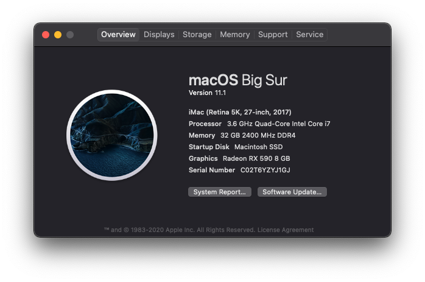

I am open to new version requests now! Post em in "issues"

## SPECS

-   OS: macOS 11.1
-   OpenCore: 0.6.4
-   CPU: Intel i7-7700
-   GPU: NITRO+ RX 590 8G G5 SE [NITRO+ RX 590 8G G5 SE](https://www.sapphiretech.com/en/consumer/nitro-rx-590-8g-g5-se_c)
-   SSD: Samsung 860 Evo 500GB 2.5 Inch Internal SSD
-   RAM: 16GB x 2 G.Skill Trident Z 3200Mhz
-   Working: Dual monitor, audio, HornDis (USB Tethering), ethernet
-   Not Working: iServices, no USB map done (as of yet)
